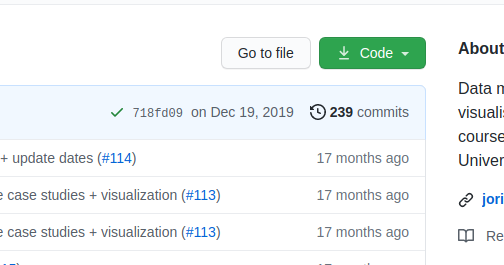

# Course setup

To get started, you should have the following three elements setup:

1. Download the course material to your computer
2. Install Python and the required Python packages using `conda`
3. Test your configuration and installation
4. Start Jupyter lab

In the following sections, more details are provided for each of these steps. When all three are done, you are ready to start coding!

## 1. Getting the course materials

### Option 1: You are already a git user

As the course has been set up as a [git](https://git-scm.com/) repository managed on [Github](https://github.com/jorisvandenbossche/DS-python-geospatial),
you can clone the entire course to your local machine. Use the command line to clone the repository and go into the course folder:

```
git clone https://github.com/jorisvandenbossche/DS-python-geospatial.git
cd DS-python-geospatial
```

In case you would prefer using Github Desktop,
see [this tutorial](https://help.github.com/desktop/guides/contributing-to-projects/cloning-a-repository-from-github-to-github-desktop/).

### Option 2: You are not a git user

To download the repository to your local machine as a zip-file, click the  `download ZIP` on the
repository page <https://github.com/jorisvandenbossche/DS-python-geospatial> (green button "Code"):



After the download, unzip on the location you prefer within your user account (e.g. `My Documents`, not `C:\`). Watch out for a nested 'DS-python-geospatial/DS-python-geospatial' folder structure after unzipping and move the inner DS-python-geospatial folder to your preferred location.

__Note:__ Make sure you know where you stored the course material, e.g. `C:/Users/yourusername/Documents/DS-python-geospatial`.

## 2. Install Python and the required Python packages using `conda`

For scientific and data analysis, we recommend to use `conda`, a command line
tool for package and environment management (<https://docs.conda.io/projects/conda/>).
`conda` allows us to install a Python distribution with the the scientific libraries
we will use in this course (this recommendation applies to all
platforms, so for both Windows, Linux and Mac).

### 2.1 Install `conda`

#### Option 1: I do not have `conda` installed

We recommend to use the installer provided by the conda-forge community: <https://conda-forge.org/download/>.

Follow the instructions on that page, i.e. first download the appropriate
installed (depending on your operating system), and then run that installer.

On Windows, this will mean double-clicking the downloaded `.exe` file, and
following the instructions. During installation, choose the options (click checkbox):

- '_Register Miniforge3 as my default Python 3.12_' (in case this returns an error about an existing Python 3.12 installation, remove the existing Python installation using [windows Control Panel](https://support.microsoft.com/en-us/windows/uninstall-or-remove-apps-and-programs-in-windows-4b55f974-2cc6-2d2b-d092-5905080eaf98)).
- '_Clear the package cache upon completion_'.

On MacOS or Linux, you have to open a terminal,
and run `bash Miniforge3-$(uname)-$(uname -m).sh`

#### Option 2: I already have `conda`, Anaconda or Miniconda installed

When you already have an installation of `conda` or Anaconda, you have to make
sure you are working with a recent version. If you installed it only a few
months ago, this step is probably not needed, otherwise follow the next steps:

1. Open a terminal window (on Windows, use the dedicated "Anaconda Prompt" or "Miniforge Prompt", via Start Menu)
2. Run `conda update conda`, by typing that command, hit the ENTER-button
   (make sure you have an internet connection), and respond with *Yes* by typing `y`.
3. Run `conda config --add channels conda-forge`, by typing that command, hit the ENTER-button
4. Run `conda config --set channel_priority strict`, by typing that command, hit the ENTER-button

If you are using Anaconda on Windows, replace each time "Miniforge Prompt" by "Anaconda Prompt" in the following sections.

### 2.2 Setup after `conda` installation

Now we will use `conda` to install the Python packages we are going to use
throughout this course.
As a good practice, we will create a new _conda environment_ to work with.

The packages used in the course are enlisted in
an [`environment.yml` file](https://raw.githubusercontent.com/jorisvandenbossche/DS-python-geospatial/main/environment.yml). The file looks as follows:

```
name: DS-geospatial
channels:
- conda-forge
dependencies:
- python=3.12
- geopandas
- ...
```

The file contains information on:
- `name` is the name used for the environment
- `channels` to define where to download the packages from
- `dependencies` contains each of the packages

The environment.yml file for this course is included in the course material you
downloaded.

Now we can create the environment:

1. Open the terminal window (on Windows use "Miniforge Prompt", open it via Start Menu > 'Miniforge Prompt')
2. Navigate to the directory where you downloaded the course materials (that
   directory should contain a `environment.yml` file, double check in your file explorer):

   ```
   cd FOLDER_PATH_TO_COURSE_MATERIAL
   ```

3. Create the environment by typing the following commands line by line +
   hitting the ENTER-button (make sure you have an internet connection):

   ```
   conda env create -f environment.yml
   ```

__!__ `FOLDER_PATH_TO_COURSE_MATERIAL` should be replaced by the path to the
folder containing the downloaded course materials (e.g. in the example it is `C:/Users/yourusername/Documents/DS-python-geospatial`)

__!__ You can safely ignore the warning `FutureWarning: 'remote_definition'...`.

Respond with *Yes* by typing `y` when asked. Output will be printed and if no error occurs, you should have the environment configured with all packages installed.

When finished, keep the terminal window (or "Miniforge Prompt") open (or reopen it). Execute the following commands to check your installation:

```
conda activate DS-geospatial
ipython
```

Within the terminal, a Python session will be started in which you can start writing Python! Type the following command:

```
import pandas
import matplotlib
```

If no message is returned, you're all set! If a message (probably an error) returned, contact the instructors. Copy paste the message returned.

To get out of the Python session, type:

```
quit
```

## 3. Test your configuration

To check if your packages are properly installed, open the Conda Terminal again (see above) and navigate to the course directory:

```
cd FOLDER_PATH_TO_COURSE_MATERIAL
```

With `FOLDER_PATH_TO_COURSE_MATERIAL` replaced by the path to the folder with the downloaded
course material (e.g. in the example it is `C:/Users/yourusername/Documents/DS-python-geospatial`).

Activate the newly created conda environment:

```
conda activate DS-geospatial
```

Then, run the `check_environment.py` script:

```
python check_environment.py
```

When all checkmarks are ok, you're ready to go!


## 4.(_start of day during course_)  Starting Jupyter Notebook with Jupyter Lab

Each of the course modules is set up as a [Jupyter notebook](http://jupyter.org/), an interactive  environment to write and run code. It is no problem if you never used jupyter notebooks before as an introduction to notebooks is part of the course.


* In the terminal (or "Miniforge Prompt"), navigate to the `DS-python-geospatial` directory (downloaded or cloned in the previous section)

  ```
  cd FOLDER_PATH_TO_COURSE_MATERIAL
  ```

* Ensure that the correct environment is activated.

  ```
  conda activate DS-geospatial
  ```

* Start a jupyter notebook server by typing

  ```
  jupyter lab
  ```

## Next?

This will open a browser window automatically. Navigate to the course directory (if not already there) and choose the `notebooks` folder to access the individual notebooks containing the course material.