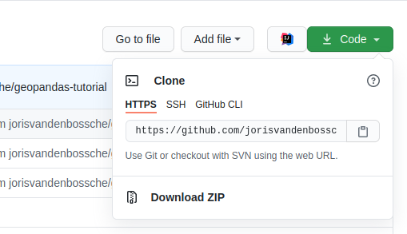
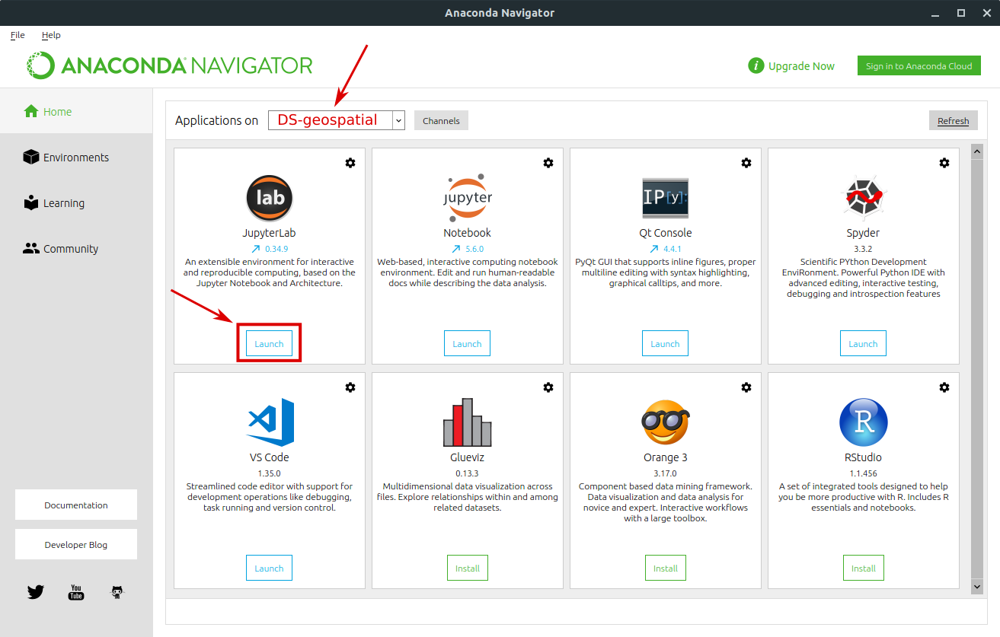

# Course setup

To get started, you should have the following three elements setup:

1. Download the course material to your computer
2. Install Python and the required Python packages
3. Start Jupyter lab

In the following sections, more details are provided for each of these steps. When all three are done, you are ready to start coding!

## 1. Getting the course materials

### Option 1: You are a git user?

As the course has been setup as a [git](https://git-scm.com/) repository managed on [Github](https://github.com/jorisvandenbossche/DS-python-geospatial), you can clone the entire course to your local machine:

Use the command line to clone the repository and go into the course folder:

```
> git clone https://github.com/jorisvandenbossche/DS-python-geospatial.git
> cd DS-python-geospatial
```

In case you would prefer using Github Desktop, see [this tutorial](https://help.github.com/desktop/guides/contributing-to-projects/cloning-a-repository-from-github-to-github-desktop/).

### Option 2: You are not a git user?

To download the repository to your local machine as a zip-file, click the  `download ZIP` on the repository page <https://github.com/jorisvandenbossche/DS-python-geospatial> (green button "Clone"):



After the download, unzip on the location you prefer within your user account (e.g. `My Documents`, not `C:\`).

__Note:__ You will need the path to the folder where you unzipped the course material in part 2 of the setup, so make sure you know where you put the course material, e.g. `C:/Users/yourusername/Documents/DS-python-geospatial`.


## 2. Install Python and the required Python packages

For scientific and data analysis, we recommend to use Anaconda (or Miniconda) (<https://www.anaconda.com/download/>), which provides a Python distribution that includes the scientific libraries (this recommendation applies to all platforms, so for both Windows, Linux and Mac), instead of installing Python as such. After installation, proceed with the setup.

### Install Anaconda

#### Option 1: I do not have Anaconda  installed

For first time users and people not fully confident with using the command line, we advise to install Anaconda, by downloading and installing the Python 3.x version from <https://www.anaconda.com/download/>. Recent computers will require the 64-Bit installer.

For more detailed instructions to install Anaconda, check the [Windows](https://docs.anaconda.com/anaconda/install/windows/), [Mac](https://docs.anaconda.com/anaconda/install/mac-os/) or [linux](https://docs.anaconda.com/anaconda/install/linux/) installation tutorial.

**Note:** When you are already familiar to the command line and Python environments you could opt to use Miniconda instead of Anaconda and download it from <https://conda.io/miniconda.html>. The main difference is that Anaconda provides a graphical user interface (Anaconda navigator) and a whole lot of scientific packages (e.g <https://docs.anaconda.com/anaconda/packages/py3.6_win-64/>) when installing, whereas for Miniconda the user needs to install all packages using the command line. On the other hand, Miniconda requires less disk space.

#### Option 2: I have installed Anaconda  earlier

When you already have an installation of Anaconda, you have to make sure you are working with the most recent versions. As the course is developed for Python 3, make sure you have Anaconda3 (on Windows, check Start > Programs > Anaconda3). If not, reinstall Anaconda according to the previous section.

Start the Anaconda Navigator program (for Windows users: Start > Anaconda Navigator) and go to the Environments tab. You should see the *base (root) environment*, click the arrow next to it and click `Open terminal`, as shown in the following figure:


Type following command + ENTER-button (make sure you have an internet connection):

```
conda update -n root conda
```

when finished, type (+ ENTER-button):

```
conda update --all
```

and respond with *Yes* by typing `y`. Packages should be updated after the completion of the command.

### Setup after installation

As not all packages we will use in the course are provided by default as part of Anaconda, we have to add the package to Anaconda to get started. As a good practice, we will create a new _conda environment_ to work with. This environment will contain the required packages of the project.

Start the Anaconda Navigator program (for windows users: Start > Anaconda Navigator) and go to the Environments tab. You should see the *base (root) environment*, click the arrow next to it and click `Open terminal`, as shown in the following figure:


Type following commands line by line + ENTER-button (make sure you have an internet connection):

```
conda config --add channels conda-forge
conda config --set channel_priority strict
cd FILE_PATH_TO_COURSE_MATERIAL_AS_DOWNLOADED_IN_STEP_1
conda env create -f environment.yml
```

__!__ `FILE_PATH_TO_COURSE_MATERIAL_AS_DOWNLOADED_IN_STEP_1` should be replaced by the file path to the folder with the downloaded course material. In the example earlier, this was `C:/Users/yourusername/Documents/DS-python-geospatial`, but make sure you use your specific folder (as seen in File Explorer).

Respond with *Yes* by typing `y` when asked. Output will be printed and if no error occurs, you should have the environment configured with all packages installed.

**Note:** If you did use Miniconda instead, create the environment using the same commands/instructions.

### Test your installation

To check if your packages are properly installed, open the Terminal again and navigate to the course directory (see above). Run the `check_environment.py` script:

```
python check_environment.py
```

When all is green, you're ready to go!


## 3. Starting Jupyter Notebook with Jupyter Lab

Each of the course modules is set up as a [Jupyter notebook](http://jupyter.org/), an interactive  environment to write and run code. It it no problem if you never used jupyter notebooks before as an introduction to notebooks is part of the course.

### Option 1: Using the command line

* In the terminal, navigate to the `DS-python-geospatial` directory (downloaded or cloned in the previous section)

* Ensure that the correct environment is activated.

  ```
  conda activate DS-geospatial
  ```

* Start a jupyter notebook server by typing

  ```
  $ jupyter lab
  ```

### Option 2: Using Anaconda Navigator

In the Anaconda Navigator *Home* tab, first switch to the course environment, called `DS-geospatial` in the selection bar. Next, select the Launch button under the Jupyter Lab icon:



## Next?

This will open a browser window automatically. Navigate to the course directory (if not already there) and choose the `notebooks` folder to access the individual notebooks containing the course material.
